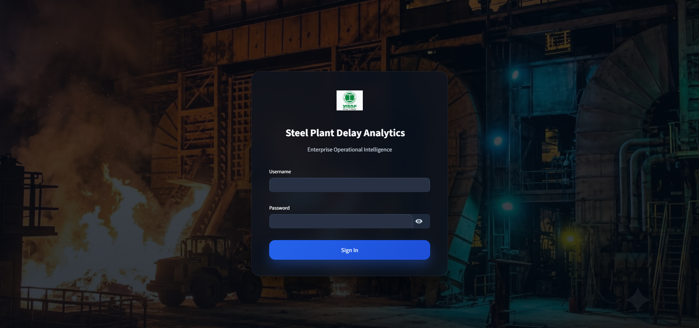
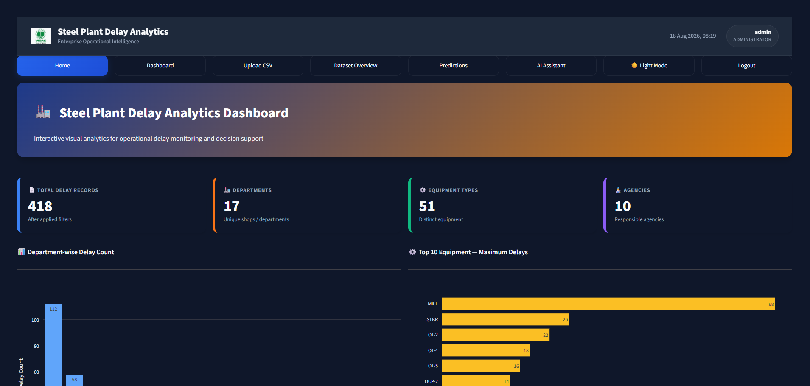
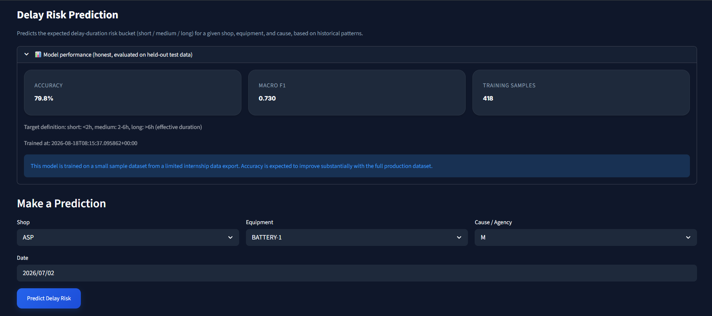

# Steel Plant Delay Analytics

**An enterprise-grade operational intelligence platform built on real internship data from India's largest integrated steel plant.**

Transforms raw shift-log data into actionable insights through role-based dashboards, predictive ML models, and an AI-powered assistant—all while maintaining strict data governance.

---

## Demo

| Login | Home Dashboard | Delay Risk Prediction |
|---|---|---|
|  |  |  |

## 🎯 What This Project Does

Plant delays cost money. Equipment breaks down. Materials run short. Shifts record these events in paper logs and spreadsheets. But nobody aggregates them. Nobody predicts them. Nobody learns from them.

**This platform changes that:**

- **Ingest** delay logs from Excel/CSV files matching real steel-plant format
- **Store** historical delay data in a normalized, queryable database
- **Analyze** with Pareto charts, equipment reliability metrics, cross-shop comparisons—all computed server-side via SQL
- **Predict** delay duration (short/medium/long) using a Random Forest model, with transparent accuracy metrics
- **Query** live plant data through natural language via Groq AI—grounded answers, never made-up numbers
- **Control** who sees what: Operators view only their shop; admins see everything; JWT tokens are properly revoked at logout

---

## ✨ Key Features

| Feature | What It Does | Why It Matters |
|---------|-------------|---|
| **Role-Based Access Control** | Operators see only their shop; Admins see all shops | Data isolation at API level + database; prevents data leakage |
| **Delay Risk Prediction** | Predicts if a delay will be short (<2h), medium (2–6h), or long (>6h) | Allows plant managers to anticipate impact and allocate resources |
| **Pareto Analysis** | Ranks causes by total delay hours; shows top 20% causes driving 80% impact | Focuses improvement efforts on highest-impact problems |
| **Equipment Reliability** | MTTR (mean time to repair), failure counts per equipment | Identifies which equipment needs maintenance most urgently |
| **AI Assistant** | Ask questions about plant data in plain English; get live answers | Faster insights than manual report writing |
| **Token Revocation** | JWTs are blacklisted on logout; cannot be replayed even within TTL | Prevents token-based account takeover after logout |
| **Audit Trail** | Every file upload logged with filename, mode (append/replace), record count, uploader | Full traceability for compliance and debugging |

---

## 🛠 Technology Stack

| Layer | Technology | Why This Choice |
|-------|-----------|---|
| **Backend** | FastAPI (Python 3.11) | Fast, async-native, auto-generates OpenAPI docs |
| **Database** | PostgreSQL 16 + SQLAlchemy ORM | Relational schema ensures data integrity; SQL aggregation is fast |
| **Authentication** | JWT (python-jose) + bcrypt | Stateless tokens; passwords never stored plaintext |
| **Prediction** | scikit-learn Random Forest | Interpretable; works well with categorical features; low inference latency |
| **AI Assistant** | Groq API (`groq/compound` model) | Fast inference; grounded responses via prompt injection |
| **Frontend** | Streamlit | Rapid UI prototyping; integrates well with Python backend |
| **Infrastructure** | Docker + Docker Compose | Consistent dev/prod environment; easy onboarding |
| **Testing** | pytest + GitHub Actions | 100% endpoint coverage; CI/CD on every push |

---

## System Architecture

```
┌─────────────┐      REST + JWT      ┌───────────────┐        SQL        ┌────────────┐
│  Streamlit   │ ───────────────────► │    FastAPI     │ ─────────────────► │ PostgreSQL │
│  Frontend    │ ◄─────────────────── │    Backend     │ ◄───────────────── │            │
└─────────────┘   streaming chat      └───────┬────────┘                    └────────────┘
                                               │
                        ┌──────────────────────┼──────────────────────┐
                        ▼                      ▼                      ▼
              scikit-learn model      SQL aggregation engine     Groq API
              (delay risk bucket)     (Pareto, MTTR, KPIs)   (grounded Q&A, streamed)
```

---

## Project Structure

```
Steel-Plant-Delay-Analytics/
├── backend/
│   ├── app/
│   │   ├── core/
│   │   │   ├── config.py
│   │   │   ├── database.py
│   │   │   ├── security.py
│   │   │   └── logging_config.py
│   │   │
│   │   ├── models/
│   │   │   └── models.py
│   │   │
│   │   ├── schemas/
│   │   │   └── schemas.py
│   │   │
│   │   ├── routers/
│   │   │   ├── auth.py
│   │   │   ├── delays.py
│   │   │   ├── analytics.py
│   │   │   ├── predictions.py
│   │   │   ├── assistant.py
│   │   │   └── upload.py
│   │   │
│   │   ├── services/
│   │   │   ├── analytics_engine.py
│   │   │   ├── ingestion.py
│   │   │   ├── ml_engine.py
│   │   │   └── groq_client.py
│   │   │
│   │   ├── ml/
│   │   │   ├── train_model.py
│   │   │   └── model_store.py
│   │   │
│   │   └── main.py
│   │
│   ├── alembic/
│   ├── tests/
│   ├── requirements.txt
│   ├── Dockerfile
│   └── seed.py
│
├── frontend/
│   ├── app.py
│   ├── pages_content/
│   │   ├── login.py
│   │   ├── home.py
│   │   ├── graphs.py
│   │   ├── predictions.py
│   │   ├── assistant.py
│   │   ├── dataset_overview.py
│   │   ├── upload.py
│   │   └── utils.py
│   │
│   ├── assets/styles/
│   │   ├── theme.css
│   │   ├── dashboard.css
│   │   ├── sidebar.css
│   │   ├── components.css
│   │   ├── assistant.css
│   │   ├── upload.css
│   │   └── login.css
│   │
│   ├── requirements.txt
│   ├── Dockerfile
│   └── .streamlit/config.toml
│
├── data/
│   └── sample_delay_logs.xlsx
│
├── docs/
│   └── screenshots/
│
├── docker-compose.yml
├── .env.example
├── .gitignore
├── pyproject.toml
├── README.md
└── LICENSE
```


---

## 🚀 Quick Start

### Prerequisites
- Docker Desktop (running)
- 2 GB free disk space
- 5 minutes

### Setup

**1. Clone and configure**
```bash
git clone https://github.com/<jr8281>/Steel-Plant-Delay-Analytics.git
cd Steel-Plant-Delay-Analytics
cp .env.example .env
```

**2. Edit `.env`** (3 fields to change)
```bash
POSTGRES_PASSWORD=your_strong_password_here
JWT_SECRET_KEY=your_random_32_char_secret_here
GROQ_API_KEY=your_groq_api_key_here  # Get free key from https://groq.com
```

**3. Start the stack**
```bash
docker compose up --build
```

**4. Seed database** (in a new terminal)
```bash
docker compose exec backend python seed.py /data/sample_delay_logs.xlsx
```

Creates two demo accounts:
- **Admin**: `admin` / `admin123`
- **Operator**: `operator` / `operator123`

**5. Open the app**
- Frontend: http://localhost:8501
- API Docs: http://localhost:8000/docs

**6. Train the ML model**
- Log in as admin
- Go to **Predictions** page
- Click **Train Model Now**

---

## 📊 Features in Detail

### Analytics Dashboard
- **KPI Cards**: Total delays, unique shops, equipment types, agencies
- **Department Breakdown**: Delay count per shop (bar chart)
- **Equipment Ranking**: Top 10 equipment by failure count (horizontal bar)
- **Pareto Analysis**: Causes ranked by total delay hours (80/20 rule)
- **MTTR Metrics**: Mean time to repair per equipment
- **Cross-Shop Comparison**: Which shop has the most delays

### Predictions
- Input: shop code, equipment, cause, delay date
- Output: predicted risk bucket (short/medium/long) + confidence + probabilities
- Trained on: historical delay durations using one-hot-encoded features
- Prevents label leakage by excluding duration-derived features

### AI Assistant
- Ask questions: *"Which equipment causes the most delays?"*
- Grounded responses: answers pulled from live aggregated data, not hallucinated
- Streaming chat: responses appear word-by-word, no lag
- Multi-turn: conversation history maintained per session

---

## 🔐 Security & Data Governance

| Concern | Solution |
|---------|----------|
| **Token Replay** | JTI claim + database blacklist checked on every request |
| **Shop Data Leakage** | Row-level filtering applied at service layer + API layer |
| **Password Storage** | bcrypt hashing with 12 rounds |
| **API Documentation** | No hardcoded examples with real credentials |
| **Non-Root Containers** | Backend & frontend run as unprivileged users |
| **Audit Trail** | Every file upload logged (who, when, filename, mode) |

---

## 📈 API Examples

### Login
```bash
curl -X POST http://localhost:8000/auth/login \
  -H "Content-Type: application/json" \
  -d '{"username":"admin","password":"admin123"}'
```

**Response:**
```json
{
  "access_token": "eyJhbGc...",
  "token_type": "bearer",
  "role": "admin",
  "shop_id": null,
  "must_reset_password": false
}
```

### Predict Delay Duration
```bash
curl -X POST http://localhost:8000/predictions/predict \
  -H "Authorization: Bearer <token>" \
  -H "Content-Type: application/json" \
  -d '{
    "shop_code": "01",
    "equipment_name": "Conveyor",
    "agency_code": "O",
    "delay_date": "2026-08-24"
  }'
```

**Response:**
```json
{
  "predicted_bucket": "medium",
  "confidence": 0.62,
  "probabilities": {
    "short": 0.21,
    "medium": 0.62,
    "long": 0.17
  }
}
```

### Get Dashboard KPIs
```bash
curl -X GET http://localhost:8000/analytics/home-dashboard \
  -H "Authorization: Bearer <token>"
```

**Response:**
```json
{
  "kpis": {
    "total_records": 187,
    "departments": 4,
    "equipment_types": 12,
    "agencies": 8
  },
  "department_delays": [...],
  "top_equipment": [...]
}
```

---

## ✅ Testing

**Run all tests** (40+ cases)
```bash
docker compose exec backend pytest -v
```

**With coverage report**
```bash
docker compose exec backend pytest --cov=app --cov-report=html
docker compose exec backend python -m http.server --directory htmlcov
# Open http://localhost:8000/
```

**Test categories:**
- `test_auth_logout.py` → Token revocation working correctly
- `test_analytics.py` → SQL aggregations, shop scoping
- `test_ml_engine.py` → Model training, predictions
- `test_ingestion.py` → CSV/XLS parsing
- `test_ingestion_log.py` → Audit trail creation

---

## 📋 Known Limitations

| Limitation | Impact | Workaround |
|-----------|--------|-----------|
| Sample dataset is small (~200 rows) | Prediction accuracy is proof-of-concept, not production-grade | Use full historical dataset for production training |
| No chat history persistence | Sessions reset on backend restart | Store in database if needed (see Future Work) |
| Replace mode is full re-sync | No row-level diffing for partially overlapping uploads | Check file dates before uploading |
| Groq API key required for assistant | App degrades to static snapshot if key missing | Optional; feature gracefully disabled |

---

## 🔮 Future Improvements

- [ ] Persist chat history to database for multi-device access
- [ ] Time-series features (rolling failure rates) to improve prediction accuracy
- [ ] Automatic session cleanup with metrics dashboard
- [ ] Row-level diffing to detect duplicate records in append mode
- [ ] CI coverage reporting (currently runs tests, no report generation)
- [ ] Mobile-responsive frontend (currently desktop-optimized)
- [ ] Export dashboards as PDF reports
- [ ] Alert system for anomaly detection

---

**Code Standards:**
- Python 3.11+, PEP 8 with Black (line length 120)
- Type hints required for function signatures
- All new features need corresponding tests
- Commit messages: `feat:`, `fix:`, `docs:`, `test:` prefixes

**Development Setup:**
```bash
git clone <repo>
cd Steel-Plant-Delay-Analytics
cp .env.example .env
docker compose up --build
docker compose exec backend pytest -v
```

---

## 📝 License

MIT License — See LICENSE file for details.
Built during a 1-month internship at Visakhapatnam Steel Plant (RINL), June - July 2026.

---
